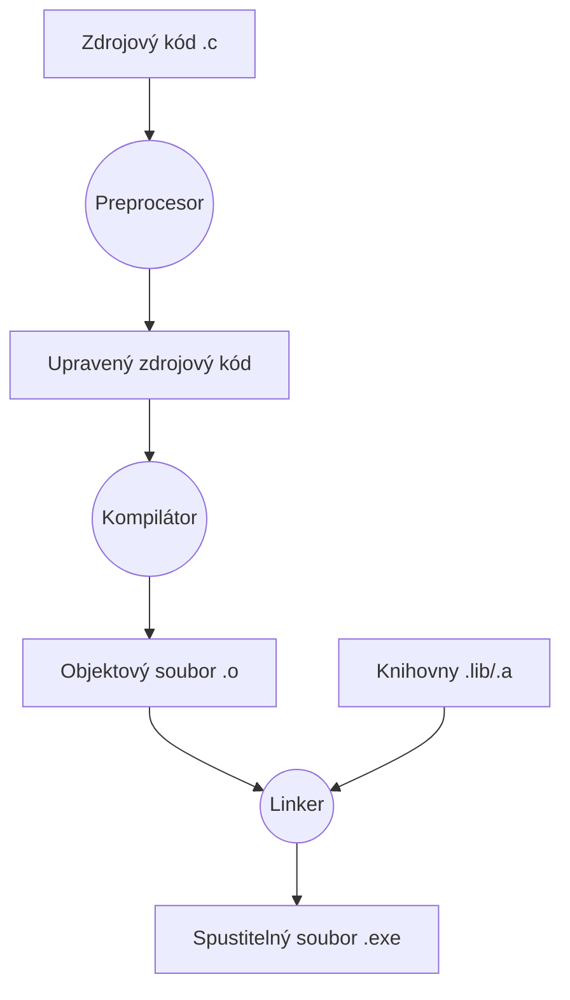
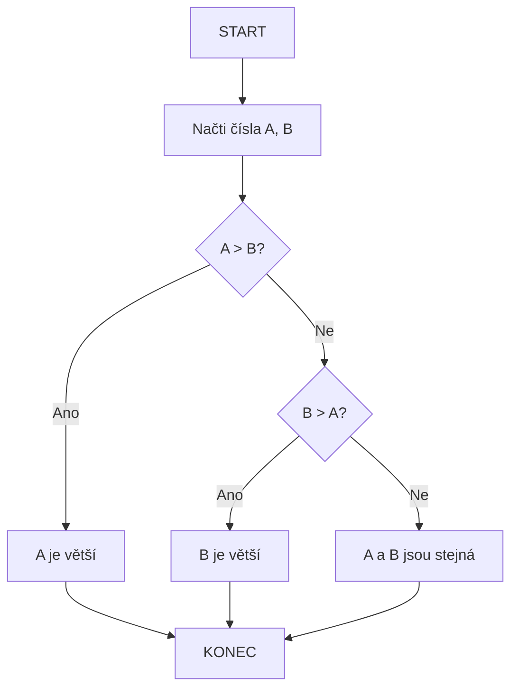

 Jasně, pojďme si rozebrat jednotlivé body v kontextu jazyka C.

### 1. Postup při řešení problému

Řešení problémů v programování, zejména v jazyce C, obvykle zahrnuje systematický přístup:

*   **Pochopení problému:** Prvním a nejdůležitějším krokem je důkladné porozumění zadání. Co přesně je požadováno? Jaké jsou vstupy, jaké mají být výstupy, jaká jsou omezení (např. velikost dat, časová náročnost)?
*   **Návrh řešení (Algoritmizace):** Po pochopení problému navrhněte posloupnost kroků (algoritmus), která povede k řešení. V této fázi se zaměřte na logiku a obecný postup, nikoli na konkrétní syntaxi jazyka C. K tomu lze využít vývojové diagramy nebo pseudokód.
*   **Implementace (Programování):** Navržený algoritmus přeložte do konkrétního programovacího jazyka, v tomto případě do jazyka C. Napíšete zdrojový kód, který implementuje jednotlivé kroky algoritmu.
*   **Testování a ladění (Debugging):** Po napsání kódu je nezbytné jej otestovat. Použijte různé vstupní hodnoty, včetně těch hraničních a neočekávaných, abyste ověřili správnost fungování. Pokud program vykazuje chyby, je nutné je identifikovat a opravit (proces ladění).
*   **Dokumentace a údržba:** Zdrojový kód by měl být okomentován, aby byl srozumitelný pro ostatní (nebo pro vás v budoucnu). Program může být později aktualizován, vylepšován nebo integrován do větších systémů.

### 2. Definice a vlastnosti algoritmu

*   **Definice:** Algoritmus je konečná, jednoznačně definovaná posloupnost kroků (instrukcí), která řeší konkrétní problém nebo provádí specifický výpočet. Je to tedy přesný "návod" na dosažení cíle.
*   **Vlastnosti:**
	- **Elementárnost** - algoritmus se skládá z konečného počtu
	jednoduchých kroků, které jsou pro realizátora srozumitelné.
	-  **Determinovanost** – v každé fázi zpracování musí být určen další postup.
	-  **Konečnost** – činnost algoritmu skončí v reálném čase.
	-  **Rezultativnost** – algoritmus dává pro stejné vstupní údaje vždy stejné výsledky.
	-  **Hromadnost** – algoritmus musí být použitelný pro všechny úlohy stejného typu.
	-  **Efektivnost** – algoritmus se uskuteční v co nejkratším čase a při nejmenším počtu činnosti.

### 3. Možnosti zápisu algoritmu

Algoritmy lze představit několika způsoby:

*   **Vývojový diagram (Flowchart):** Grafické znázornění algoritmu pomocí standardizovaných symbolů. Je vizuálně přehledný.
*   **Pseudokód (Pseudocode):** Neformální, ale strukturovaný popis algoritmu, který kombinuje prvky přirozeného jazyka s běžnými programovacími konstrukcemi (např. `POKUD`, `CYKLUS`, `NAČTI`, `VYPIŠ`). Není vázán na specifickou syntaxi programovacího jazyka, ale je bližší programování než čistý přirozený jazyk.
*   **Programovací jazyk (např. C):** Přímá implementace algoritmu ve formě zdrojového kódu. Toto je forma, kterou může počítač zpracovat po překladu. V jazyce C se algoritmy typicky implementují pomocí funkcí, proměnných, řídicích struktur (cykly, podmínky) a datových typů.

### 4. Zpracování programu v jazyce C

Proces transformace zdrojového kódu napsaného v jazyce C na spustitelný program probíhá v několika fázích, které zajišťují různé nástroje:

1.  **Psaní zdrojového kódu:** Programátor napíše kód v textovém editoru nebo integrovaném vývojovém prostředí (IDE) a uloží jej jako soubor s příponou `.c` (např. `muj_program.c`).

2.  **Preprocesor ([[10. Činnosti Preprocessoru]]):**
    *   **Co dělá:** Zpracovává speciální direktivy, které začínají znakem `#`. Tyto direktivy nejsou součástí samotného jazyka C, ale řídí práci preprocesoru.
        *   `#include`: Vkládá obsah souborů (typicky hlavičkových `.h` souborů se deklaracemi funkcí a maker) do aktuálního souboru.
        *   `#define`: Definuje makra (textové náhrady) nebo konstanty. Příklad: `#define MAX_SIZE 100`. Preprocesor nahradí všechny výskyty `MAX_SIZE` číslem `100`.
        *   Podmíněné překlady (`#ifdef`, `#ifndef`, `#if`, `#else`, `#endif`): Umožňuje zahrnout nebo vynechat části kódu na základě definovaných podmínek. To je užitečné pro různé operační systémy nebo konfigurace.
    *   **Co nedělá:** Neprovádí kontrolu syntaxe C ani sémantickou analýzu kódu. Pouze provádí textové náhrady a vkládání souborů.
    *   **Výstup:** Preprocesor produkuje upravený zdrojový kód (často nazývaný "translation unit" nebo "preprocessed source file").

3.  **Kompilátor (Compiler):**
    *   **Co dělá:** Vezme výstup z preprocesoru a převede jej do jazyka symbolických instrukcí (assembly language) a dále do strojového kódu. Během této fáze provádí:
        *   **Lexikální analýzu:** Rozdělení kódu na základní stavební bloky (tokeny: klíčová slova, identifikátory, operátory, literály).
        *   **Syntaktickou analýzu:** Kontrolu, zda struktura kódu odpovídá gramatice jazyka C (např. správné použití závorek, středníků, klíčových slov).
        *   **Sémantickou analýzu:** Kontrolu významu kódu (např. zda jsou typy proměnných kompatibilní, zda jsou proměnné deklarovány před použitím).
        *   **Generování strojového kódu:** Převod C kódu na instrukce procesoru.
    *   **Co nedělá:** Neřeší propojení mezi různými zdrojovými soubory nebo s externími knihovnami.
    *   **Výstup:** Kompilátor vyprodukuje tzv. **objektový soubor** (např. `muj_program.o` nebo `muj_program.obj`). Tento soubor obsahuje strojový kód pro daný zdrojový soubor, ale může obsahovat nedořešené odkazy na funkce nebo proměnné definované jinde.

4.  **Linker (Linker):**
    *   **Co dělá:** Vezme jeden nebo více objektových souborů (vygenerovaných kompilátorem z vašich `.c` souborů) a propojí je dohromady. Také propojí váš kód se standardními knihovnami C (např. `printf`, `scanf` z `libc`) a případně s dalšími sdílenými nebo statickými knihovnami.
        *   Řeší externí odkazy: Pokud váš kód volá funkci definovanou v jiném objektovém souboru nebo knihovně, linker najde její definici a propojí volání s ní.
    *   **Co nedělá:** Nemění zdrojový kód ani neprovádí jeho překlad. Jeho úkolem je pouze spojit již přeložené části.
    *   **Výstup:** Vytvoří finální **spustitelný soubor** (např. `muj_program` na Linuxu, `muj_program.exe` na Windows).

5.  **Spuštění (Execution):**
    *   Operační systém načte spustitelný soubor do paměti a předá řízení hlavnímu vstupnímu bodu programu (obvykle funkci `main`). Program se začne vykonávat.

**Shrnutí procesu překladu:**



### 5. Správná tvorba vývojového diagramu

Vývojový diagram je vizuální nástroj pro reprezentaci algoritmu nebo procesu. Správná tvorba zajišťuje jeho čitelnost a efektivitu.

**Základní symboly:**

*   **Ovál / Zaoblený obdélník (Terminator):** Označuje **START** a **KONEC** algoritmu.
*   **Obdélník (Process):** Reprezentuje **operaci**, výpočet, přiřazení hodnoty, nebo jinou činnost. Např. `x = a + b;`.
*   **Kosočtverec (Input/Output):** Označuje **vstup** dat nebo **výstup** výsledků. Např. `Načti číslo N;`, `Vypiš výsledek;`.
*   **Kosočtverec s vrcholem dolů (Decision):** Reprezentuje **rozhodovací bod**, kde program na základě podmínky vybírá jednu z několika možných cest. Z tohoto symbolu vycházejí minimálně dvě větve, typicky označené "Ano" (True) a "Ne" (False). Např. `Je A > B?`.
*   **Šipky (Flow lines):** Spojují symboly a ukazují **směr toku řízení** (pořadí provádění kroků).
*   **Kruh (Connector):** Používá se k propojení částí diagramu, které jsou na stejné stránce, ale nejsou přímo vedle sebe, nebo k zjednodušení složitých toků.
*   **Válec (Data / Database):** Reprezentuje data nebo databázi. Méně častý v základních algoritmech.

**Pravidla pro správnou tvorbu:**

1.  **Jednoznačný START a KONEC:** Každý diagram musí mít právě jeden symbol START a právě jeden symbol KONEC.
2.  **Logický tok:** Šipky by měly primárně směřovat zleva doprava a shora dolů. Pokud je nutné směřování v jiném směru, musí být jasně viditelné.
3.  **Přehlednost a minimalizace křížení:** Používejte dostatek místa. Křížení šipek znesnadňuje čtení. Pokud je to nutné, použijte konektory.
4.  **Jeden krok na symbol:** Každý symbol by měl reprezentovat jednu jasnou operaci nebo rozhodnutí. Nesnažte se do jednoho symbolu nacpat příliš mnoho instrukcí.
5.  **Výstižné popisky:** Text uvnitř symbolů musí být stručný a jasný. Podmínky u rozhodovacích symbolů by měly být formulovány jako otázky nebo výroky s jasnou odpovědí Ano/Ne.
6.  **Konzistence:** Používejte symboly konzistentně v celém diagramu.

**Příklad 1: Větvení (Podmínka)**
Nalezení většího ze dvou čísel A a B:

```mermaid
graph TD
    A[START] --> B[/Načti čísla A, B/];
    B --> C{Je A > B?};
    C -- Ano --> D[Vypiš "A je větší"];
    C -- Ne --> E{Je B > A?};
    E -- Ano --> F[Vypiš "B je větší"];
    E -- Ne --> G[Vypiš "A a B jsou stejná"];
    D --> H[KONEC];
    F --> H;
    G --> H;
```

**Příklad 2: Cyklus (Iterace)**
Výpočet součtu čísel od 1 do N (demonstrace smyčky):


Tento diagram ukazuje, jak se program "vrací" zpět (šipka od `Inc` k `Cond`), dokud je podmínka splněna.