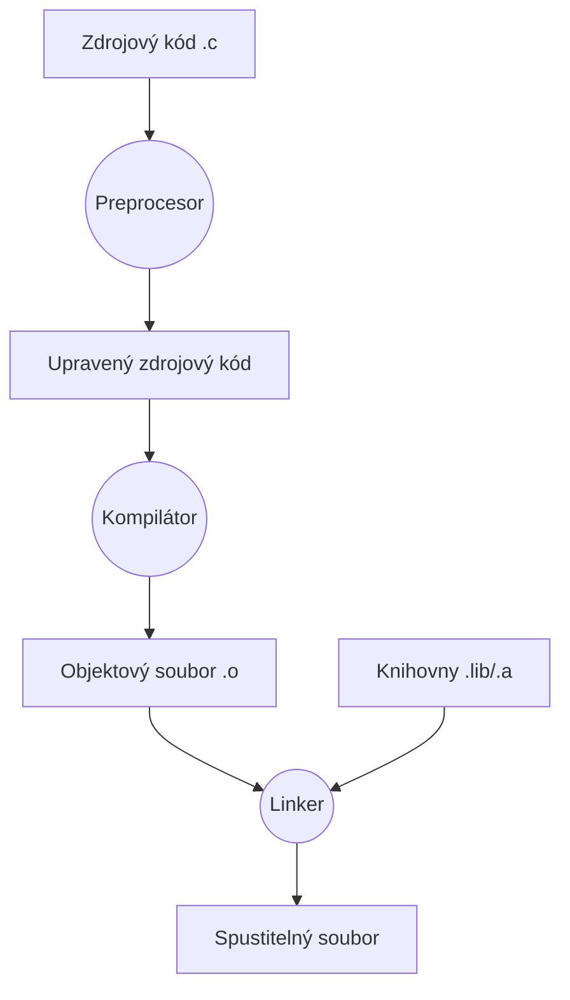
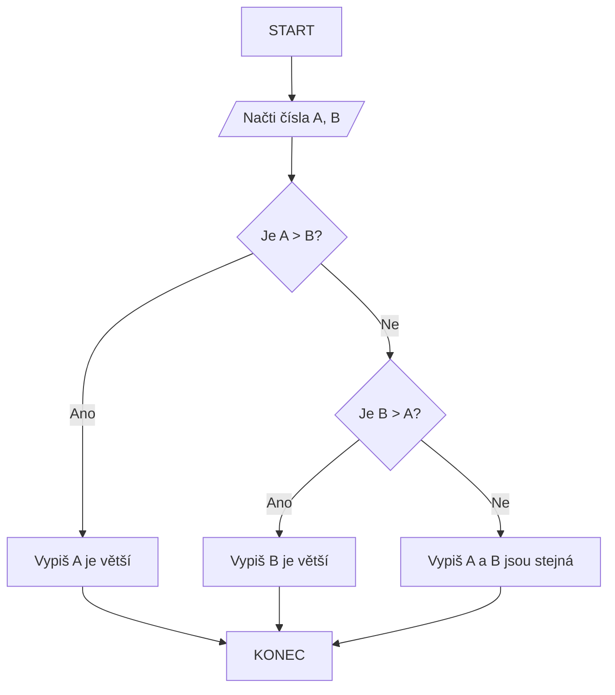
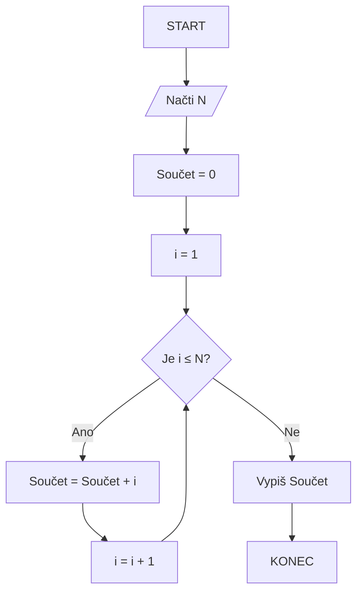

### 1. Algoritmus

*   **Definice:** **Algoritmus** je konečná posloupnost jednoznačně definovaných kroků vedoucích k vyřešení daného problému.

*   **Vlastnosti algoritmu:**
	- **Konečnost** - musí skončit po konečném počtu kroků
	- **Determinovanost** - každý krok je přesně definovaný, zná krok předchozí a krok následující
	- **Hromadnost** - řeší obecnou třídu problémů, je aplikovatelný na více vstupů
	- **Resultativnost** - algoritmus má vždy výsledek, i chyba je výsledek
	- **Elementárnost** - krok je základní (co možná nejmenší) akce kterou provádíme
	- **Efektivnost** – algoritmus se uskuteční v co nejkratším čase a při nejmenším počtu činnosti.
### 2. Algoritmizace

*  **Definice:** **Algoritmizace** je vytvoření přesného postupu řešení problému

-  **Proces tvorby programu:**
	1. **Analýza problému** - pochopení zadání
	2. **Návrh algoritmu** - vytvoření postupu řešení
	3. **Implementace** - zápis algoritmu v programovacím jazyce
	4. **Testování a ladění** - hledání a oprava chyb

### 3. Způsoby zápisu algoritmu

Algoritmus lze zapisovat různými způsoby:

#### 3.1 Slovní popis

- Popis kroků běžným jazykem
- Příklad:
	1. Načti dvě čísla
	2. Sečti je
	3. Vypiš výsledek
#### 3.2 Vývojový diagram (Flowchart)
- Grafické znázornění algoritmu pomocí symbolů.

#### 3.3 Pseudokód (Pseudocode)
- Neformální, ale strukturovaný popis algoritmu, který kombinuje prvky přirozeného jazyka s běžnými programovacími konstrukcemi (např. `POKUD`, `CYKLUS`, `NAČTI`, `VYPIŠ`). Není vázán na specifickou syntaxi programovacího jazyka, ale je bližší programování než čistý přirozený jazyk.

#### 3.4 Programovací jazyk (např. C)
- Přímá implementace algoritmu ve formě zdrojového kódu. Toto je forma, kterou může počítač zpracovat po překladu. V jazyce C se algoritmy typicky implementují pomocí funkcí, proměnných, řídicích struktur (cykly, podmínky) a datových typů.

### 4. Zpracování programu v jazyce C

Proces transformace zdrojového kódu napsaného v jazyce C na spustitelný program probíhá v několika fázích, které zajišťují různé nástroje:

1.  **Psaní zdrojového kódu:** Programátor napíše kód v textovém editoru nebo integrovaném vývojovém prostředí (IDE) a uloží jej jako soubor s příponou `.c`/`.h` (např. `muj_program.c`/`muj_header.h`).

2.  **Preprocesor ([[10. Činnosti Preprocessoru]]):**
    *   **Co dělá:** Zpracovává speciální direktivy, které začínají znakem `#`. Tyto direktivy nejsou součástí samotného jazyka C, ale řídí práci preprocesoru.
        *   `#include`: Vkládá obsah souborů (typicky hlavičkových `.h` souborů se deklaracemi funkcí a maker) do aktuálního souboru.
        *   `#define`: Definuje makra (textové náhrady) nebo konstanty. Příklad: `#define MAX_SIZE 100`. Preprocesor nahradí všechny výskyty `MAX_SIZE` číslem `100`.
        *   Podmíněné překlady (`#ifdef`, `#ifndef`, `#if`, `#else`, `#endif`): Umožňuje zahrnout nebo vynechat části kódu na základě definovaných podmínek. To je užitečné pro různé operační systémy nebo konfigurace.
    *   **Co nedělá:** Neprovádí kontrolu syntaxe C ani sémantickou analýzu kódu. Pouze provádí textové náhrady a vkládání souborů.
    *   **Výstup:** Preprocesor produkuje upravený zdrojový kód (často nazývaný "translation unit" nebo "preprocessed source file").

3.  **Kompilátor (Compiler):**
    *   **Co dělá:** Vezme výstup z preprocesoru a převede jej do jazyka symbolických instrukcí (assembly language) a dále do strojového kódu. Během této fáze provádí:
        *   **Lexikální analýzu:** Rozdělení kódu na základní stavební bloky (tokeny: klíčová slova, identifikátory, operátory, literály).
        *   **Syntaktickou analýzu:** Kontrolu, zda struktura kódu odpovídá gramatice jazyka C (např. správné použití závorek, středníků, klíčových slov).
        *   **Sémantickou analýzu:** Kontrolu významu kódu (např. zda jsou typy proměnných kompatibilní, zda jsou proměnné deklarovány před použitím).
        *   **Generování strojového kódu:** Převod C kódu na instrukce procesoru.
    *   **Co nedělá:** Neřeší propojení mezi různými zdrojovými soubory nebo s externími knihovnami.
    *   **Výstup:** Kompilátor vyprodukuje tzv. **objektový soubor** (např. `muj_program.o` nebo `muj_program.obj`). Tento soubor obsahuje strojový kód pro daný zdrojový soubor, ale může obsahovat nedořešené odkazy na funkce nebo proměnné definované jinde.

4.  **Linker (Linker):**
    *   **Co dělá:** Vezme jeden nebo více objektových souborů (vygenerovaných kompilátorem z vašich `.c` souborů) a propojí je dohromady. Také propojí váš kód se standardními knihovnami C (např. `printf`, `scanf` z `libc`) a případně s dalšími sdílenými nebo statickými knihovnami.
        *   Řeší externí odkazy: Pokud váš kód volá funkci definovanou v jiném objektovém souboru nebo knihovně, linker najde její definici a propojí volání s ní.
    *   **Co nedělá:** Nemění zdrojový kód ani neprovádí jeho překlad. Jeho úkolem je pouze spojit již přeložené části.
    *   **Výstup:** Vytvoří finální **spustitelný soubor** (např. `muj_program` na Linuxu, `muj_program.exe` na Windows).

5.  **Spuštění (Execution):**
    *   Operační systém načte spustitelný soubor do paměti a předá řízení hlavnímu vstupnímu bodu programu (obvykle funkci `main`). Program se začne vykonávat.

**Shrnutí procesu překladu:**

### 4. Správná tvorba vývojového diagramu

Vývojový diagram je vizuální nástroj pro reprezentaci algoritmu nebo procesu. Správná tvorba zajišťuje jeho čitelnost a efektivitu.

**Základní symboly:**

| **Symbol**                   | Význam                                           |
| ---------------------------- | ------------------------------------------------ |
| **Ovál / Zaoblený obdélník** | START a KONEC                                    |
| **Kosodélník**               | Input/Output `Načti číslo N;`, `Vypiš výsledek;` |
| **Kosočtverec**              | Rozhodovací bod                                  |
| **Obdélník**                 | Operace, např.: `a = b + c`                      |
| **Šipky**                    | Směr toku řízení                                 |
| **Kruh**                     | Skok (přehlednost)                               |
| **Válec**                    | Data nebo databázi                               |

**Pravidla pro správnou tvorbu:**

1.  **Jednoznačný START a KONEC:** Každý diagram musí mít právě jeden symbol START a právě jeden symbol KONEC.
2.  **Logický tok:** Šipky by měly primárně směřovat zleva doprava a shora dolů. Pokud je nutné směřování v jiném směru, musí být jasně viditelné.
3.  **Přehlednost a minimalizace křížení:** Používejte dostatek místa. Křížení šipek znesnadňuje čtení. Pokud je to nutné, použijte konektory.
4.  **Jeden krok na symbol:** Každý symbol by měl reprezentovat jednu jasnou operaci nebo rozhodnutí. Nesnažte se do jednoho symbolu nacpat příliš mnoho instrukcí.
5.  **Výstižné popisky:** Text uvnitř symbolů musí být stručný a jasný. Podmínky u rozhodovacích symbolů by měly být formulovány jako otázky nebo výroky s jasnou odpovědí Ano/Ne.
6.  **Konzistence:** Používejte symboly konzistentně v celém diagramu.

**Příklad 1: Větvení (Podmínka)**
Nalezení většího ze dvou čísel A a B:

**Příklad 2: Cyklus (Iterace)**
Výpočet součtu čísel od 1 do N (demonstrace smyčky):

Tento diagram ukazuje, jak se program "vrací" zpět (šipka od `Inc` k `Cond`), dokud je podmínka splněna.